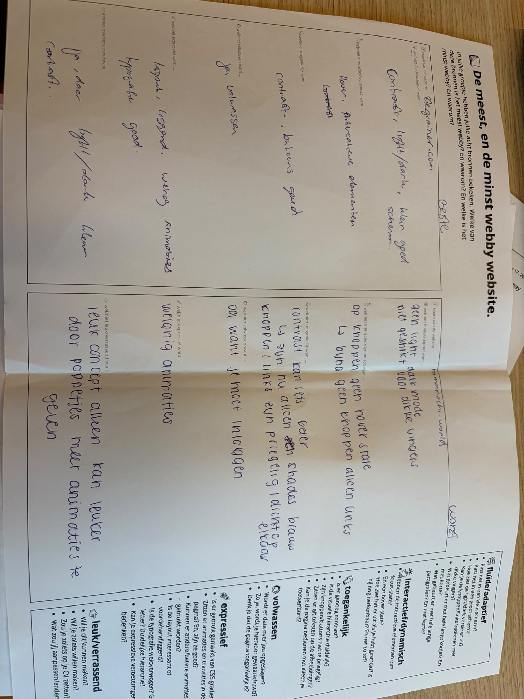

# Model

Het staat model voor digitale tuintjes welke bij 'Het web is voor iedereen' door studenten worden gemaakt.

## Learning Log

### checkout vr 18 sep

Github is een platform waar je een start kan maken aan het ontwerpen van je eigen website zo koppel je het met code

Dewischaik.nl ik heb dit gekoppeld door ip adressen en de domeinnaam in GitHub zetten
Waarom geven de docenten deze opdracht?
De docenten geven deze opdracht zodat ik HTML en CSS leer gebruiken en daardoor een betere digitale ontwerper word.
Welke technieken gebruik ik?
Ik gebruik vooral HTML en CSS. HTML gebruik ik voor de structuur en interactie, en CSS voor de vormgeving, layout en animaties.
Wat zijn de randvoorwaarden?
Ik moet rekening houden met mijn tijd, mijn kennis, toegankelijkheid, privacy en of mijn ontwerp echt als website werkt.
Wat heb ik geleerd door mijn schetsen?
Door verschillende schetsen te maken kon ik meerdere ideeën onderzoeken en beter zien hoe mijn website eruit kan komen te zien. Door te schetsen ontdek ik ook details die ik niet meteen in mijn hoofd zie.
Wat wil ik nog onderzoeken?
Ik wil vooral onderzoeken welke ideeën technisch haalbaar zijn met HTML en CSS en hoe ik mijn website interactief en adaptief kan maken.
Hoe ga ik mijn ontwerp testen?
Ik wil een werkend prototype maken met HTML en CSS. Daarna kan ik testen of bezoekers mijn website begrijpen en of de interacties werken.
Waar moet ik tijdens het maken op letten?
Ik moet regelmatig controleren of mijn website:
HTML valide heeft
toegankelijk is
adaptief werkt op verschillende schermgroottes
met light en dark mode werkt
voldoet aan de wet en privacyregels
nog steeds bij mijzelf en mijn ontwerp past.

### retrospect vr 18 sep

moet nog komen!

### checkout wo 16 sep

1. 3 principes

Balans: Elementen zijn goed verdeeld, zodat het ontwerp rustig en prettig oogt.
Symmetrie: Elementen zijn aan beide kanten ongeveer gelijk verdeeld.
Nabijheid: Elementen die bij elkaar horen, staan dicht bij elkaar.

2. Grid

Een grid geeft structuur, maar je kunt binnen die structuur nog steeds spelen met de grootte en positie van elementen.

3. Principe voor mijn Garden

Ik neem vooral balans mee. Ik wil verschillende afbeeldingen en teksten gebruiken, maar ze zo verdelen dat mijn website niet te druk of rommelig wordt.

![beschrijving]{link afbeelding}

### checkout ma 14 sep

1. Leg uit wanneer een website 'lelijk' wordt en geef voorbeelden wat je kan doen om deze 'lelijke' onderdelen te fixen?

als je alleen html pagina hebt geen css om het mooi te maken, je fixt het met flexbox, grid.

2. Vertel welke volgende stap je neemt om je website responsive te maken.

door flexbox en grid toe te passen

3. Kun je het ontwerp en de bouw van je eigen Garden (zo uit je hoofd) onderbouwen in Webby vocabulair?
   Ik heb gekozen voor een persoonlijke, kleurrijke en expressieve stijl. Met balans, symmetrie en proximity houd ik de website overzichtelijk. Ik gebruik HTML en CSS, flexbox en grid om de website responsive en interactief te maken. Hover-effecten, klikbare elementen en animaties zorgen voor een dynamische en leuke gebruikerservaring.

### workshop ma 14 sep

bi-weekly groepsopdracht

opdracht 16 - Teresa
tips: meer fotos toevoegen, mijn layout veranderen zodat niet alles links staat. alles centreren

opdracht 17 - Hiba

1. als het scherm kleiner wordt wordt de header een menu
2. de tekst wordt kleiner maar nog in verhouding met de pagina en goed leesbaar
3. UI design wordt minimaal gemaakt. minder tekst meer fotos

### workshop vr 11 sep

opdracht 14
Inhoud van mijn pagina
Mijn pagina bevat titels, teksten, afbeeldingen en links over mijzelf en mijn interesses, zoals films, reizen, kleding en mijn vriendengroep. De afbeeldingen zijn vooral eigen foto's of beelden die de onderwerpen ondersteunen.
Vormgeving van mijn pagina
Ik gebruik een kleurrijke en persoonlijke stijl met verschillende kleuren, afbeeldingen en vormen. Ik gebruik custom properties en light/dark-mode om de kleuren aan te passen en zorg met responsive CSS dat de vormgeving op verschillende schermformaten goed werkt.

opdracht 12-13
ik was er deze les niet maar dit zijn mijn 5 schetsen:

### checkout vr 11 sep

ik heb geen feedback gehad want ik was er niet

### checkout wo 9 sep

1. Waar werkt het Visual Research in 3 stappen naartoe?
   Het Visual Research werkt toe naar een duidelijke visuele stijl voor mijn Digital Garden. Door verschillende voorbeelden, kleuren, vormen, typografie en interacties te onderzoeken, ontdek ik welke stijl het beste bij mij en mijn website past.
   Waar gaat mijn Garden over?
2. Mijn Garden gaat over mij en mijn interesses, zoals films, reizen, kleding en mijn vriendengroep. Ik gebruik hierbij vooral beeld en tekst, aangevuld met interactieve elementen zoals hover-effecten, klikbare afbeeldingen, animaties en een outfit builder.
3. Welk idee van de Crazy 8 wil ik verder onderzoeken?
   Ik wil vooral het idee van de outfit builder (schets 8) verder onderzoeken. Dit lijkt mij leuk omdat de gebruiker zelf kleding kan combineren en het daardoor interactief, dynamisch en persoonlijk wordt.

### workshop wo 9 sep

opdracht 5-10
[Mijn Miro-board](https://miro.com/app/board/uXjVHq1zApo=/?moveToWidget=3458764682999666404&cot=14)

opdracht 4

1. Wat is voor jou de essentie van wat je hebt gepresenteerd?
   De essentie van mijn website is ikzelf en mijn interesses. Ik wilde niet kiezen voor één onderwerp, maar juist verschillende dingen die bij mij passen samenbrengen. Reizen, films en kleding laten allemaal iets zien van mijn persoonlijke smaak en waar ik inspiratie uit haal. De website wordt daardoor eigenlijk een soort digitaal persoonlijk platform.
2. Welke woorden uit de kwaliteitenlijst passen bij je onderwerp?
   Woorden die goed bij mijn onderwerp passen zijn:

- persoonlijk
- creatief
- inspirerend
  speels
  modern
  vrolijk
  dynamisch
  vrij
  stijlvol

3. Heeft ‘de ander’ een aanvulling op je onderwerp?
   Ja, de ander kan mijn onderwerp aanvullen door te kijken naar wat zij interessant vinden aan mijn website. Misschien vinden zij bijvoorbeeld vooral de reis- of filminspiratie leuk. Hierdoor kan ik ontdekken welke onderdelen het meest aanspreken en mijn website daarop aanpassen.
4. Wat is het karakter, de uitstraling en het gevoel?
   Ik wil dat mijn website persoonlijk, vrolijk, creatief en een beetje speels aanvoelt. Het mag niet te strak of zakelijk worden, omdat het juist mijn persoonlijkheid en interesses moet laten zien. Tegelijkertijd wil ik dat het overzichtelijk en modern blijft.
5. Welke inspiratie haal je uit je 25 afbeeldingen?
   Uit mijn afbeeldingen haal ik vooral inspiratie voor kleur en de algemene sfeer. Ik wil veel gebruikmaken van mooie foto's, bijvoorbeeld van reizen, outfits en films. Ook vind ik een speelse indeling interessant, waarbij niet alles perfect recht en hetzelfde hoeft te staan. De afbeeldingen geven mij vooral inspiratie voor een creatieve, persoonlijke en visueel aantrekkelijke stijl.

Wat zou je willen vertellen over het onderwerp aan een ander?
Ik wil vooral laten zien wat ik leuk vind en waar ik zelf inspiratie uit haal. Ik zie mijn Digital Garden daarom vooral als een visuele en persoonlijke plek. Ik wil veel werken met eigen foto's, afbeeldingen en korte teksten. Bij reizen kan ik bijvoorbeeld foto's van bestemmingen, accommodaties en fotospots laten zien met een korte uitleg. Bij films kan ik posters gebruiken met mijn eigen rating en mening. Voor kleding kan ik outfits en inspiratiebeelden verzamelen. Zo wordt het een soort persoonlijke inspiratiepagina, een beetje vergelijkbaar met Pinterest, maar dan met mijn eigen smaak en content.
Vul de zin aan:
Ik wil mijn Digital Garden laten gaan over mijn persoonlijke interesses, zoals reizen, films en kleding,
en wil dat laten zien door foto's, inspiratiebeelden, korte teksten en mijn eigen meningen aan content te tonen.
Ik begin met een stukje eigen content over mijn favoriete reisbestemmingen en fotospots.
Als het begin is gemaakt kan ik mijn Garden verder uitbreiden door steeds nieuwe films, outfits, bestemmingen en andere dingen die mij inspireren toe te voegen.

### checkout ma 7 sep

1. een digital garden is een plek waar je aan werkt en nooit echt af is, er zijn verschillende opvattingen en visies van hoe je er naar kijkt/gebruikt.
2. websites die webby zijn voldoen aan een aantal eissen,
3. Ik wil aan de slag met een persoonlijke Digital Garden over mijzelf en mijn interesses. Ik wil hierin verschillende onderwerpen combineren, zoals films, reizen, kleding en mijn vriendengroep, waarbij ik vooral wil werken met kleurrijke beelden, tekst en interactieve elementen. Mijn eerste idee is om de website speels en persoonlijk te maken, zodat de gebruiker op verschillende manieren mijn interesses kan ontdekken.

### opdracht 3 ma 7 sep

staat in oefeningen

### opdracht 2 ma 7 sep

Vanuit de inventarisatie: wat wil ik zelf maken?

- Ik wil een persoonlijke en kleurrijke Digital Garden maken waarin verschillende interesses van mij samenkomen. Ik wil vooral dingen gebruiken die ik nog niet zo goed kan, zoals meer interactieve animaties, hover-effecten en een outfit builder, omdat ik hiermee de website interessanter en dynamischer kan maken.
  Welke webby dingen wil ik gebruiken?
- Ik wil onder andere gebruikmaken van:
  Hover-effecten bij afbeeldingen en knoppen.
  Klikbare afbeeldingen die naar andere pagina's leiden.
  Animaties en beweging tijdens het scrollen.
  Een interactieve wereldkaart.
  Een filmstrip waar je door films kunt bladeren.
  Een outfit builder waarbij je verschillende kledingstukken kunt combineren.
  Welke eigen content ga ik maken?
  Mijn content gaat vooral over mijzelf en mijn interesses, zoals films, reizen, kleding en mijn vriendengroep. De toon wordt persoonlijk, vrolijk en spontaan, zodat de website echt als mijn eigen plek voelt. Ik wil bijvoorbeeld mijn eigen filmratings en meningen schrijven, mijn favoriete reisplekken en fotospots delen en vertellen waarom bepaalde dingen mij aanspreken.
  Gebruik ik content van anderen?
- Ik kan afbeeldingen gebruiken als inspiratie of als onderdeel van mijn onderzoek, maar ik wil zoveel mogelijk eigen foto's, illustraties en teksten gebruiken. Als ik materiaal van anderen gebruik, moet ik kijken of ik daar toestemming voor heb of dat het materiaal vrij gebruikt mag worden; bij bijvoorbeeld films kan ik informatie en afbeeldingen gebruiken als onderdeel van mijn onderwerp, maar ik moet rekening houden met auteursrecht. Door mijn eigen mening, ervaringen, foto's en vormgeving toe te voegen, wordt het verhaal persoonlijker en meer mijn eigen content.
  Op welke manier is de content te ervaren?
- Ik wil dat mijn Garden niet alleen bestaat uit tekst en afbeeldingen, maar dat de gebruiker er doorheen kan ontdekken en spelen. Door te klikken, te hoveren, te scrollen en bijvoorbeeld zelf outfits samen te stellen, wordt de website interactief; met animaties, kleuren, foto's en eventueel geluid wil ik er ook een bepaalde sfeer en beleving aan geven.

### opdracht 1 ma 7 sep

